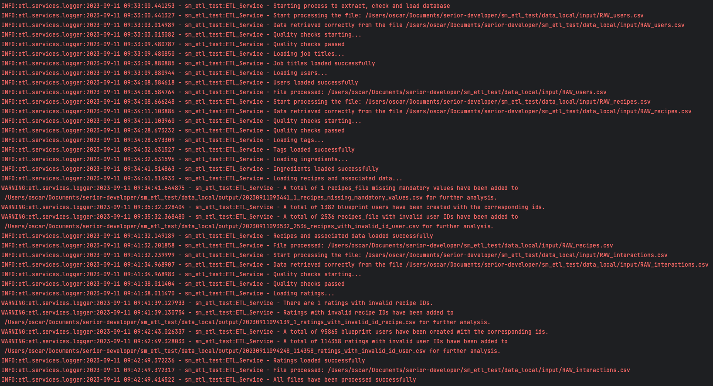
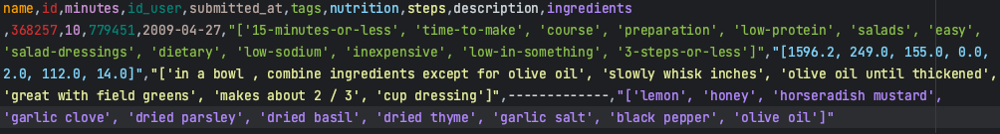

# ETL Process for Culinary Recipes Data

 

## Overview

This program is designed to perform an ETL (Extract, Transform, Load) process on three CSV files containing culinary recipes data: `RAW_recipes.csv`, `RAW_interactions.csv`, and `RAW_users.csv` (further details available [here](documentation/input-data-definitions.md)). The ETL process will extract data from these files, transform it using Python, Pandas, and SQL Alchemy, and load it into a MySQL database named `culinary_recipes_mysql`. The database schema includes tables for recipes, users, ratings, ingredients, tags, and job titles.

## Prerequisites

Before running the ETL process, ensure you have the following prerequisites:

- Python 3.x installed.
- Create a virtual environment using Pipenv.
- Start the MySQL database using Docker Compose.
- Place the CSV files (`RAW_recipes.csv`, `RAW_interactions.csv`, and `RAW_users.csv`) into the `data_local/input` folder within the project directory. This folder is designated for storing the input data for local development.

## Additional Notes

- The ETL includes error handling and logging to capture any issues that may arise during the process (further details available [here](documentation%2Fhandling-warning-and-errors-data.md))

- The ETL process is designed to handle both the insertion of new entries and the updating of existing ones. In cases where new entries conflict with existing ones, the ETL process will prioritize the new entries and override the existing ones.

- The project contains a [decision-record](documentation%2Fdecision-record.md) where important decisions and considerations made during the development of the ETL process. Those records are:
  1. [Use SQLAlchemy ORM for ETL Project](documentation%2Fdecision_records%2F001-use-sql-alchemy.md)
  2. [Create placeholder users when handling unmatched user_id](documentation%2Fdecision_records%2F002-user_placeholder.md)
  3. [Implement Batch Insert/Upsert and Rollback Decorator](documentation%2Fdecision_records%2F003-batch_upsert_and_rollback_decorator.md)
  4. [External Folder for Error File Loading](documentation%2Fdecision_records%2F004-error-file-loading-folder.md)

- To maintain code quality and consistency, a Makefile is included in the project. You can use the following commands:
  - `make format`: Formats the code following PEP8 practices and applying clean code principles to enhance code readability.
  - `make tests`: Runs the tests to ensure the functionality of the ETL process and maintain code reliability. Be sure to set up your testing environment as specified in the project documentation.

# Database Schema
This database schema stores information related to culinary recipes, users, ratings, ingredients, and tags. For more information you can check the 
[database definitions file](documentation/database-definitions.md) or see the [SQL script](database/init.sql), which is used to create the database schema and define the structure of the tables within that database

*Description: Database Schema.*

# ETL Results

In this section, you can find visual representations of the ETL process results, including logs, database snapshots, and any files generated with invalid data or warnings.

## ETL Logs

*Description: Displaying logs generated during the ETL process.*

## Invalid Processed Data

*Description: This image depicts the storage of invalid processed data in an output folder, saved in CSV files. These files capture data that did not meet the validation criteria during the ETL process.
The format of the filename is: datetime_numberincidences_description.csv*

### Invalid Data - Missing Mandatory Values

*Description: This image illustrates an example CSV file that contains data flagged as invalid during the ETL process. Specifically, it highlights instances where recipes have been associated with missing mandatory values.*

### Invalid Data - Ratings with Invalid Id Recipe

*Description: This image illustrates an example CSV file that contains data flagged as invalid during the ETL process. Specifically, it highlights instances where ratings have been associated with an invalid recipe identifier (Id Recipe).*

### Data With Invalid Id User

*Description: This image illustrates an example CSV file that contains data flagged as invalid during the ETL process. Specifically, it highlights the instances where recipes have been associated with an invalid user identifier (Id User).*

## Database Snapshot

*Description: Visual representation of the inserts to the `culinary_recipes_mysql` database using MySQL Workbench.*

# Some Unit Tests

*Description: Image capturing some unit tests using the command `make tests`.*

