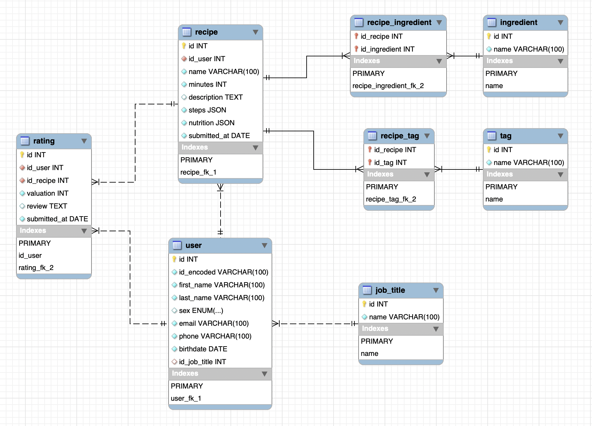

# Database Definitions

## Schema: culinary_recipes_mysql
This database schema stores information related to culinary recipes, users, ratings, ingredients, and tags. The mysql post-fix indicated the relational database management systems (RDBMS).

### Table: `job_title`
- **Description**: This table stores job titles.
- **Fields**:
  - `id` (int, primary key, auto-increment): Unique identifier for job titles.
  - `name` (varchar(100), unique): The name of the job title.

### Table: `user`
- **Description**: This table stores user information.
- **Fields**:
  - `id` (int, primary key): Unique identifier for users.
  - `id_encoded` (varchar(100)): An encoded identifier for users.
  - `first_name` (varchar(100)): The first name of the user.
  - `last_name` (varchar(100)): The last name of the user.
  - `sex` (enum('Male','Female')): The gender of the user.
  - `email` (varchar(100)): The email address of the user.
  - `phone` (varchar(100)): The phone number of the user.
  - `birthdate` (date): The birthdate of the user.
  - `id_job_title` (int): A foreign key referencing the `job_title` table, representing the user's job title.

### Table: `recipe`
- **Description**: This table stores information about recipes.
- **Fields**:
  - `id` (int, primary key): Unique identifier for recipes.
  - `id_user` (int): A foreign key referencing the `user` table, representing the user who created the recipe.
  - `name` (varchar(100)): The name of the recipe.
  - `minutes` (int): The time required to prepare the recipe in minutes.
  - `description` (text): A textual description of the recipe.
  - `steps` (json): JSON data representing the steps required to prepare the recipe.
  - `nutrition` (json): JSON data representing the nutritional information of the recipe.
  - `submitted_at` (date): The date when the recipe was submitted.

### Table: `rating`
- **Description**: This table stores user ratings and reviews for recipes.
- **Fields**:
  - `id` (int, primary key, auto-increment): Unique identifier for ratings.
  - `id_user` (int): A foreign key referencing the `user` table, representing the user who submitted the rating.
  - `id_recipe` (int): A foreign key referencing the `recipe` table, representing the recipe being rated.
  - `valuation` (int): The numeric rating given by the user (0 to 5).
  - `review` (text): An optional textual review provided by the user.
  - `submitted_at` (date): The date when the rating was submitted.

### Table: `ingredient`
- **Description**: This table stores information about ingredients.
- **Fields**:
  - `id` (int, primary key, auto-increment): Unique identifier for ingredients.
  - `name` (varchar(100), unique): The name of the ingredient.

### Table: `recipe_ingredient`
- **Description**: This table represents the many-to-many relationship between recipes and ingredients.
- **Fields**:
  - `id_recipe` (int): A foreign key referencing the `recipe` table, representing the recipe.
  - `id_ingredient` (int): A foreign key referencing the `ingredient` table, representing the ingredient.
  - **Primary Key**: Combination of `id_recipe` and `id_ingredient`.

### Table: `tag`
- **Description**: This table stores tags that can be associated with recipes.
- **Fields**:
  - `id` (int, primary key, auto-increment): Unique identifier for tags.
  - `name` (varchar(100), unique): The name of the tag.

### Table: `recipe_tag`
- **Description**: This table represents the many-to-many relationship between recipes and tags.
- **Fields**:
  - `id_recipe` (int): A foreign key referencing the `recipe` table, representing the recipe.
  - `id_tag` (int): A foreign key referencing the `tag` table, representing the tag.
  - **Primary Key**: Combination of `id_recipe` and `id_tag`.
